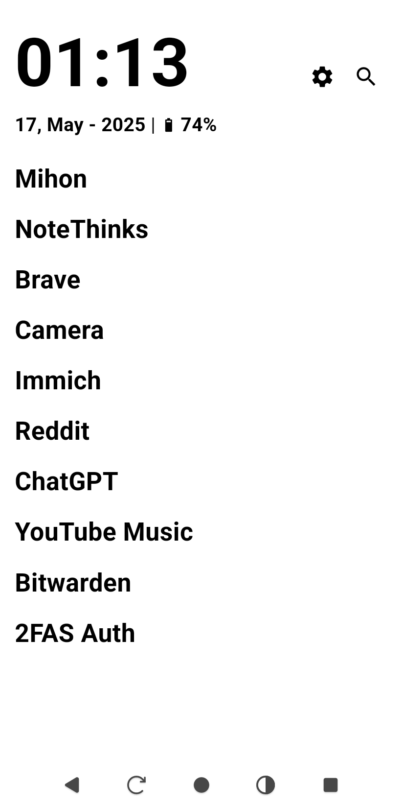
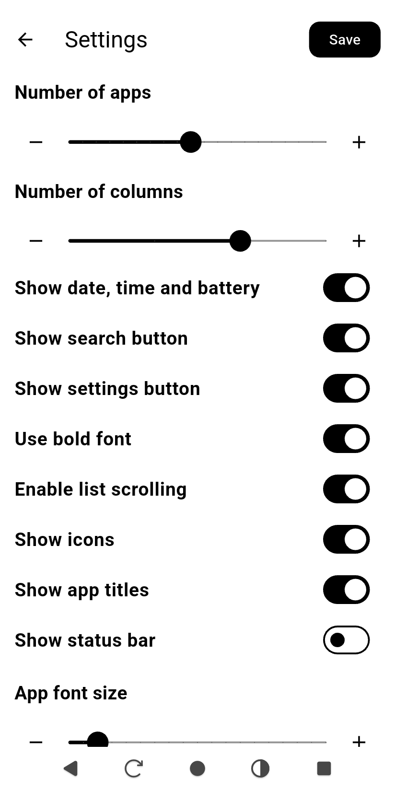
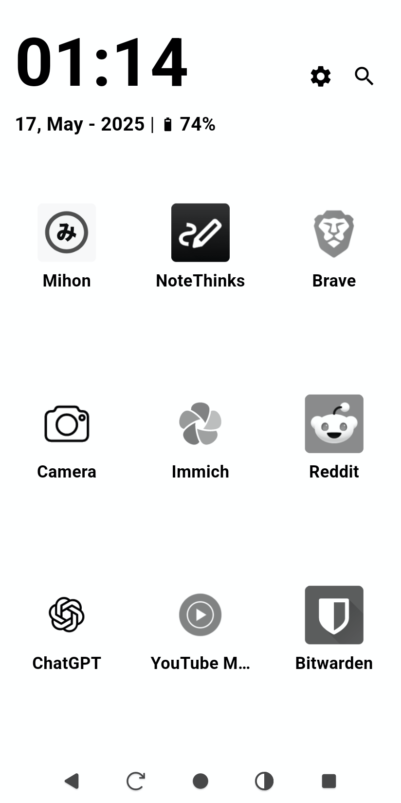
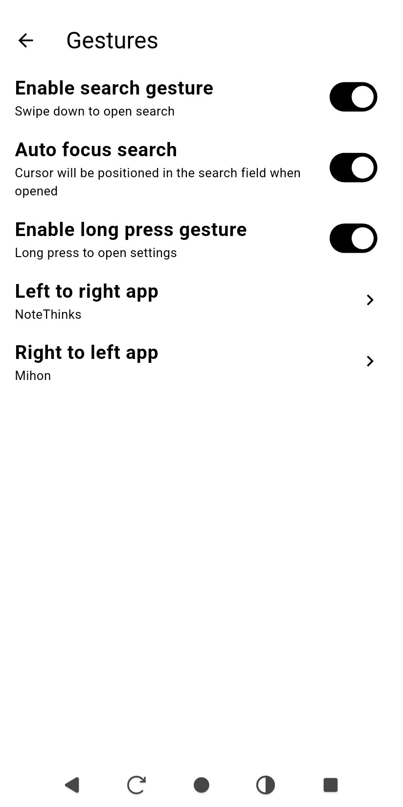

  

## Think Launcher

**Think Launcher** is a minimalist Android launcher designed specifically for **e-ink devices**. It prioritizes **simplicity**, **customization**, and uses only pure black and white tones (with options to customize them) and no animations.

## Screenshots

  
  
    
  

## Features

- **Home Screen**
  - Customize your launcher however you like, use dynamic icons or text-only labels, and place your apps  anywhere you want.
  - Support for **multiple pages** layout.
  - Customize the **font size**, **icon size**, and **text weight** (normal or bold), **icon colors**, **icon shapes**, and lot more.
  - Support for **gestures**
  - Select and sort which apps to display.

- **Search**
  - Quickly search and launch any installed app.

- **Configurable UI Elements**
  - Show or hide:
    - Settings button
    - Search button
    - Time and date.

- **Folders**
  - Create your own folders with your apps or custom web apps.

- **Optimized for e-ink**
  - Zero animations.
  - Pure black text on white background (also with a dark theme or custom themes).
  - Minimal screen redraw to reduce ghosting and save battery.
  - Option to enablke e-ink refresh on screen changes.

- **Bugs and ideas**
  - Feel free to open issues or suggestions in the repository.

## 📄 License

This project is licensed under the **MIT License**.  
You are free to use, modify, and distribute it, including for commercial purposes, as long as proper credit is given.

[View full license](./LICENSE)